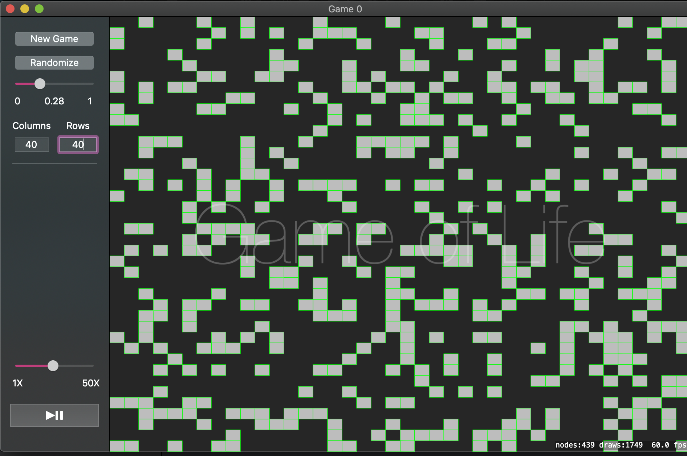

# Game Of Life

The little project is to pay tribute to the deceased mathematician, [John Horton Conway](https://en.wikipedia.org/wiki/John_Horton_Conway) and his famous zero-player game, [game of life](https://en.wikipedia.org/wiki/Conway%27s_Game_of_Life). 

Screenshot: 

## Project Layout

- Started from template SpriteKit project
- Game control: `GameSideController`
- Display logic: `GameScene`
- Game logic: `World`
- UI: `Main.storyboard`

## Todos

- Multi-window/multi-game
- Save initial state
- Clean menu items
- Common known interesting patterns as selection
- Tests
- More

## License

MIT
